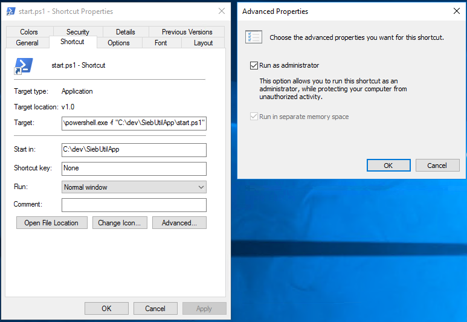
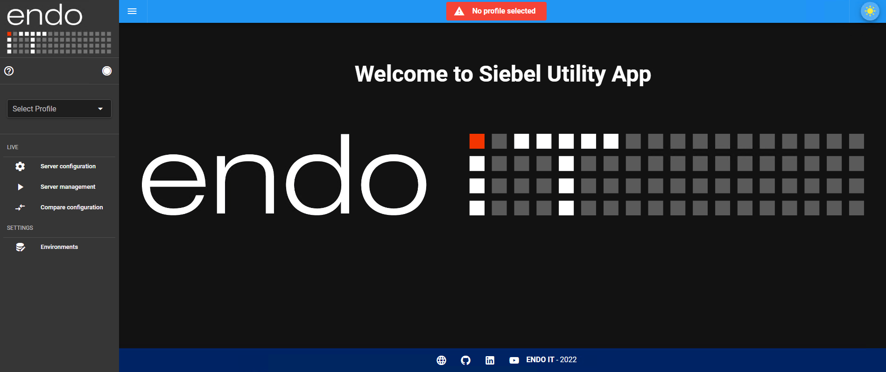
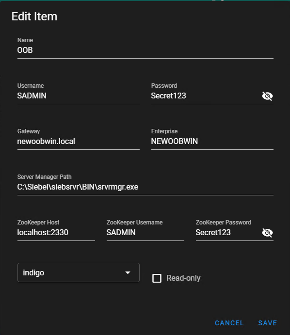
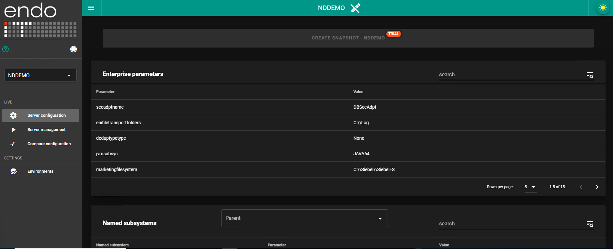
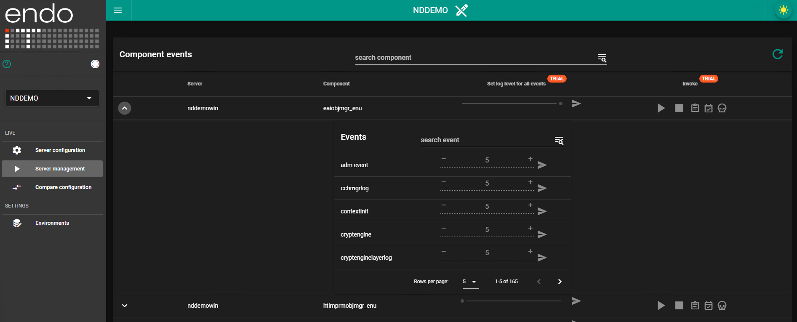
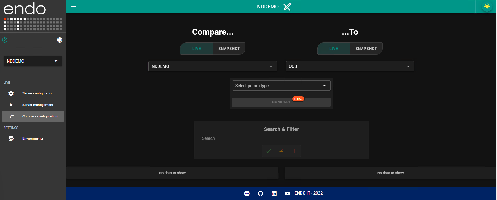
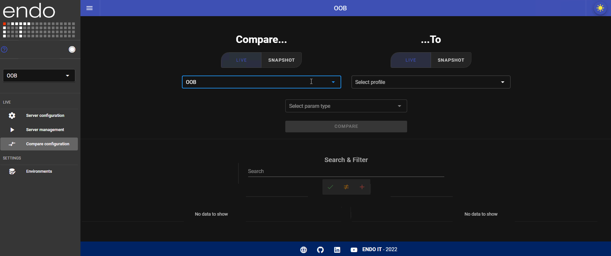

Siebel Utility Application is a lightweight full stack application, which enables interaction with Siebel Server Components easily, such as checking and changing parameters, starting and stopping them, and setting the log level for their events. Create snapshot which saves the current state of the server components. Compare the enterprise states between different environments or snapshots.

Please visit [the endo IT website](https://endoit.hu/innovates/utilityapp/) for a free link to the full version of the application. This repository contains an open source evaluation version with limited features.

# 1. Installation

**IMPORTANT**: Only use the Siebel Utility Application on development and test environments, never on production.

Requirements:
- NodeJS should be installed
- Powershell should be installed

Run the SiebUtilApp\install.ps1 script, which will install the required node modules for the back- and frontend.

If you plan to deploy the application on a Siebel Environment which does not have access to the internet, do these npm install steps first on a machine with internet access, then copy the whole SiebUtilApp folder to that machine.

In the file SiebUtilApp\BE_Node\server.js file, specify the origin port of the frontend for CORS, and the port for the node server:
```
const corsOptions = {
  origin: "http://localhost:8083"
}
const PORT = 3001;
```

In the file SiebUtilApp\start.ps1, change the __\<PATH\>__ to the path to the SiebUtilApp folder, and the __\<FE_ORIGIN_PORT\>__ to the port, where the front end will run:
```
$be = {
	Write-Host "Starting backend"
	Set-Location "<PATH>\SiebUtilApp\BE_Node"
	node server.js
}

$fe = {
	Write-Host "Starting frontend"
	Set-Location "<PATH>\SiebUtilApp\FE_Vue"
	node "<PATH>\SiebUtilApp\FE_Vue\node_modules\serve\build\main.js" -s dist -p <FE_ORIGIN_PORT>
}
```

Create a shortcut to this start.ps1, the Target field in the properties of the shortcut should be the following:
```
powershell.exe -f "<PATH>\SiebUtilApp\start.ps1"
```
Check the Run as administrator option in the advanced properties:



# 2. Usage

To start the application, run the created shortcut. It starts both the frontend and the backend, and ensures that only one instance is running from both. Only the user who started the application will see the Siebel Server Manager command line instances, so if multiple users are using the same machine, it is maybe desired to restart it with the shortcut.

After starting it, go to __http://localhost:\<FE_ORIGIN_PORT\>__ in a browser, and the application shoud be visible:



## 2.1. Profile configuration

First, a profile have to be created for the Siebel Enterprise. Click on the Environments under the Settings, then New Item, and fill the form:
- Name: name of the environment
- Username: Siebel username
- Password: Siebel password
- Gateway: address of the Siebel Gateway
- Enterprise: name of the Siebel enterprise
- Server Manager Path: path to the Siebel Server Manager
- ZooKeeper Host: host address of the ZooKeeper
- ZooKeeper Username: ZooKeeper username
- ZooKeeper Password: ZooKeeper password
- Color: color theme for the environment
- Read-only: if set to true, no parameter can be changed

After that, click on Save.



If the profile was configured successfully, select it and navigate to the Live server configuration tab, and the current enterprise and server parameters will be visible.

## 2.2. Features

### 2.2.1. Server configuration

For the selected profile, the following parameters are shown for the corresponding enterprise:
- Enterprise parameters
- Component definition parameters
- Named subsystem parameters

For all servers of the enterprise, the following parameters are shown:
- Server parameters
- Component parameters



__Additional features in the full version__

- Change any parameter directly from the Siebel Utility Application through the Siebel Server Manager
- With the __Create snapshot__ button, the current state of the server components can be saved as json

### 2.2.2. Server management

For the selected profile, shows the components for all servers, and their events and logging level of the events. Command can be issued for the component, e.g. kill, start, change the level of logging for all or a given event.



__Additional features in the full version__

- Change the logging level for all or a specific event for components
- Start, stop, kill, start tasks and list tasks for components 

### 2.2.3. Compare configuration

This is only available in the full version.



__Features in the full version__

- Compare enterprise states between live ZooKeeper data and/or snapshots.
- Search & Filter data in comparison result



[Get the full version on our website](https://endoit.hu/innovates/utilityapp/).
